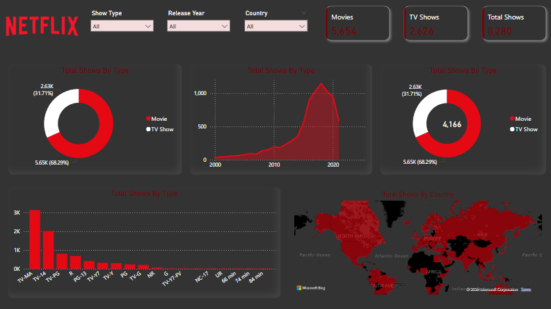

📊 Netflix Content Analysis Dashboard – Power BI Case Study
This project presents an interactive Power BI dashboard built to analyze Netflix’s global content library. The analysis explores patterns in show types, ratings, release trends, and regional content distribution to derive actionable business insights for decision-making in the OTT (Over-the-Top) streaming industry.

🎯 Project Objective
The objective of this project is to:

✅ Explore Netflix’s global content dataset to uncover trends and patterns.
✅ Provide an interactive dashboard for stakeholders to analyze content distribution.
✅ Extract insights that can help optimize content strategies and business decisions.

## 📂 Project Files  

- 📁 [netflix_analysis.pbix](netflix_analysis.pbix) – Power BI dashboard file  
- 📁 [netflix_dataset.csv](netflix_dataset.csv) – Dataset used for analysis  
- 🖼️ [netflix_dashboard_image.png](netflix_dashboard_image.png) – Dashboard preview image  
- 📄 [README.md](README.md) – Project documentation  

📈 Key Business Questions & Insights
1️⃣ What is the overall composition of Netflix’s content library?
🎬 Movies: 5,654 titles (68.29%)

📺 TV Shows: 2,626 titles (31.71%)

📌 Total Titles: 8,280
✅ Insight: Netflix has a significantly higher proportion of movies, indicating a focus on one-off content over episodic series.

2️⃣ How has content production and release evolved over time?
Between 2010–2020, there was a sharp increase in new releases.

A peak was observed in 2018–2019, reflecting Netflix’s global expansion and focus on original productions.
✅ Insight: The post-2020 decline suggests a potential impact of market saturation or global production slowdowns (e.g., pandemic).

3️⃣ Which regions have the highest number of titles?
🌎 Top 3 countries by content availability:

🇺🇸 United States – Largest content library globally.

🇮🇳 India – Leading in South Asia.

🇬🇧 United Kingdom – Dominant in Europe.
✅ Insight: These regions are Netflix’s strongest markets and could benefit from tailored content strategies to retain dominance.

4️⃣ What is the distribution of content ratings?
📊 Top Ratings by Count:

TV-MA: 3,142 titles

TV-14: 2,026 titles

R: 809 titles
✅ Insight: Netflix’s catalog skews toward mature audiences, highlighting an opportunity to diversify into family-friendly content for untapped segments.

💡 Business Impact & Recommendations
This analysis provides valuable insights for streaming platforms to:
✅ Identify content gaps and tailor production for underserved regions or demographics.
✅ Focus on content ratings balance to widen audience reach.
✅ Strategically plan regional licensing agreements and original content production.

🛠 Tools & Technologies Used
Power BI: For dashboard creation & visual storytelling

Power Query: For data cleaning & transformation

Dataset: https://www.kaggle.com/shivamb/netflix-shows

## 📸 Dashboard Preview  

  

🚀 Why this Project Matters
This project demonstrates how data visualization enables businesses like Netflix to:

📊 Make data-driven decisions about content strategies.

🧑‍💻 Empower stakeholders with interactive dashboards for exploring key metrics.

🎯 Deliver actionable insights to optimize subscriber engagement and retention.

📌 Takeaway
The Netflix Content Analysis dashboard highlights my skills in data analytics, visualization, and storytelling – transforming raw data into insights that can support impactful business decisions.
